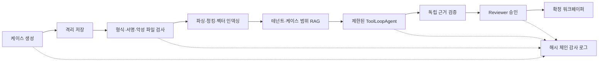

# TaxOps AI

근거가 확인된 자료만 사용해 세무 검토 초안을 만들고, 독립 검증과 전문가 승인을 거쳐 워크페이퍼로 확정하는 업무 플랫폼입니다. React와 Next.js 기반 화면부터 PostgreSQL, 파일 검역 워커, RAG 에이전트, MCP, 관측성, 컨테이너와 AWS 배포 참조까지 하나의 저장소에 구현했습니다.

라이브 포트폴리오: [taxops-ai.vercel.app](https://taxops-ai.vercel.app). 예시 데이터와 결정론적 AI 흐름만 제공하며, 입력 내용은 영구 저장되지 않습니다.


## 구현 범위



- 업무 UI: 대시보드, 케이스, 문서 보관함, AI 워크벤치, 검토·승인, 운영, 평가, 감사 로그
- 서버: 타입이 있는 REST API, 통일된 오류 응답, 요청 ID, 상태 전이, 멱등 업로드
- 데이터: PostgreSQL 16, Drizzle 스키마와 검토된 SQL 마이그레이션, pgvector, RLS, 복합 외래 키
- 파일: 비공개 격리 저장소, MIME·확장자·magic bytes와 OOXML ZIP 구조 검증, SHA-256, ClamAV, 정확한 S3 version/ETag 바인딩, 비동기 파싱과 인덱싱
- AI: hybrid retrieval, 과세기간 기준일, 버전 관리 프롬프트, 제한된 tool loop, 별도 검증 에이전트, 문서 지시 분류, 월간과 실행별 비용 예산
- 보안: OIDC Authorization Code + PKCE와 API Bearer 검증, DB 역할 확정, RBAC, RLS, 분리된 Reviewer 서비스, 일회성 승인 토큰, 외부 반출 PII 정책, 전체 감사 체인 검증
- 운영: lease 기반 작업 큐, 재시도·jitter·DLQ, 서명된 outbox 알림, health endpoints, 구조화 로그, Docker, GitHub Actions, AWS Terraform 참조
- 상호운용: 읽기 전용 세무 케이스·근거 검색 MCP 서버

세부 근거는 [요구사항 추적표](docs/requirements-traceability.md)에 정리했습니다.

## 빠른 실행

Node.js 22 이상이 필요합니다.

```bash
npm ci
cp .env.example .env.local
npm run dev
```

브라우저에서 `http://localhost:3000`을 엽니다. 기본값은 외부 서비스가 없어도 재현 가능한 데모 모드입니다. AI 응답 역시 고정 fixture를 그대로 출력하는 방식이 아니라, 질문과 검색 근거를 확인해 인용·기권 흐름을 결정하는 결정론적 로컬 경로를 사용합니다.

Vercel 포트폴리오 프리뷰는 `PORTFOLIO_DEMO=true`, `AUTH_MODE=demo`를 명시한 격리 프로필로 실행할 수 있습니다. 이 프로필은 DB, 객체 저장소, 외부 AI Gateway 또는 Reviewer 서비스가 함께 구성되면 활성화되지 않습니다. 화면의 예시 데이터와 결정론적 AI 흐름을 검토하기 위한 용도이며, 입력 내용은 영구 저장되지 않으므로 실제 고객정보나 개인정보를 입력하면 안 됩니다. 실제 운영 환경에서는 이 변수를 제거하고 OIDC와 모든 외부 의존성을 구성해야 합니다.

실제 AI Gateway를 사용하려면 `.env.local`에 `AI_GATEWAY_API_KEY`를 설정합니다. 웹 readiness는 DB와 Reviewer 서비스를 직접 호출하고, OIDC, AI, 객체 저장소, DLP, 의미 분류기와 MCP 설정을 검증합니다. Worker는 production 시작 단계에서 DB, 객체 저장소, ClamAV 연결과 문서 처리기, DLP, 의미 분류기의 인증된 설정을 따로 검증합니다. 브라우저 OIDC를 위해 `APP_BASE_URL`, authorization/token endpoint, client ID와 secret, 32자 이상의 `SESSION_SECRET`도 필요합니다. `TAXOPS_LOCAL_STACK=true`는 `NODE_ENV=development`인 로컬 Compose 계약 시험에서만 사용하며, production 웹 readiness와 Worker 시작은 이 설정을 명시적으로 거부합니다.

## 검증 명령

```bash
npm run verify       # 포맷, 린트, 타입, 단위 테스트, 평가, 프로덕션 빌드
npm run test:e2e     # 실제 Chromium 사용자 흐름과 공식 MCP 클라이언트
npm run eval         # 45개 결정론적 입력과 5개 mock agent 실행 품질 게이트
npm run audit:prod   # production 의존성 취약점 게이트
docker compose config -q
docker compose up --build --abort-on-container-exit --exit-code-from contract-test contract-test
docker compose run --rm contract-test npm run test:reviewer-service
docker compose run --rm contract-test node --import tsx scripts/run-worker-smoke.ts
```

현재 결정론적 품질 게이트는 Recall@5 90% 이상, 인용 원문 무결성 100%, 적대적 주장 무결성 사례 100%, 기권 정확도 90% 이상, prompt-injection 차단 100%, 교차 테넌트 누출 0건입니다. 평가 결과는 `artifacts/evaluation-report.json`에 저장되고 평가 화면이 이 파일을 직접 읽습니다. 이 평가는 fixture 검색, mock model orchestration과 코드 수준 무결성 회귀를 검증할 뿐, 실제 모델의 의미 정확도나 세무 정확도를 보증하지 않습니다. 실제 Gateway와 의미 분류기 경로는 별도의 staging 평가가 필요합니다.

## 프로덕션 구성

`compose.yaml`은 PostgreSQL/pgvector, MinIO, ClamAV, 마이그레이션, 웹, 워커와 독립 Reviewer 서비스를 연결합니다. 웹, 워커, Reviewer에는 서로 다른 DB 역할을 부여합니다. 웹 역할은 workpaper, version, approval 테이블에 직접 쓸 수 없고, 근거가 1건 이상이며 원문 필드 전체가 현재 DB와 일치할 때만 제한 함수가 검토 요청을 만듭니다. Reviewer 결정은 approval과 연결된 AI 실행 상태를 한 트랜잭션에서 함께 전이합니다.

`infra/terraform`은 기존 VPC와 ALB 위에 다음 리소스를 구성하는 참조 모듈입니다.

- KMS로 암호화된 비공개·버전 관리 S3 버킷
- Multi-AZ RDS PostgreSQL
- private subnet의 ECS Fargate 웹, 워커, Reviewer 서비스
- 최소 범위 IAM, 암호화된 CloudWatch 로그, 경보·대시보드, 웹 자동 확장

실제 배포 전에는 조직의 WAF, DNS·인증서, IdP, VPC endpoint, 백업, GuardDuty/Security Hub, 고가용성 ClamAV와 문서 처리 서비스를 연결하고 보안 담당자의 검토를 받아야 합니다. 자세한 절차는 [운영 런북](docs/operations-runbook.md)을 따릅니다.

## 핵심 설계 문서

- [아키텍처와 데이터 흐름](docs/architecture.md)
- [보안 위협 모델](docs/security-threat-model.md)
- [AI 품질·비용·지연 관리](docs/ai-quality.md)
- [API와 MCP 계약](docs/api.md)
- [운영 런북](docs/operations-runbook.md)
- [요구사항 추적표](docs/requirements-traceability.md)

## 사실 범위와 남은 검증

이 저장소는 해당 역할에 필요한 구현 역량을 보여 주는 end-to-end 포트폴리오입니다. 저장소 자체만으로 실제 사용자 대상 운영 경력 3년 이상을 증명할 수는 없습니다. 또한 AWS 계정에 Terraform을 적용하거나 실제 EY 환경, IdP, 세무 원천 시스템과 통합한 상태가 아닙니다.

운영 전에는 세무 전문가의 golden set 확장과 결론 검수, 실제 의미 분류기의 한국어·영어 우회 변형 평가, 실제 OIDC·KMS·S3·RDS 통합 시험, 부하·복구·침투 테스트, 개인정보 영향평가, 법무·보존 정책 승인이 추가로 필요합니다. 공식 세무 원천의 서명 또는 신뢰 가능한 digest 검증과 감사 체인의 외부 WORM·서명 anchor도 조직 환경에서 연결해야 합니다. 이 프로젝트는 EY의 공식 제품이나 보증물이 아닙니다.
