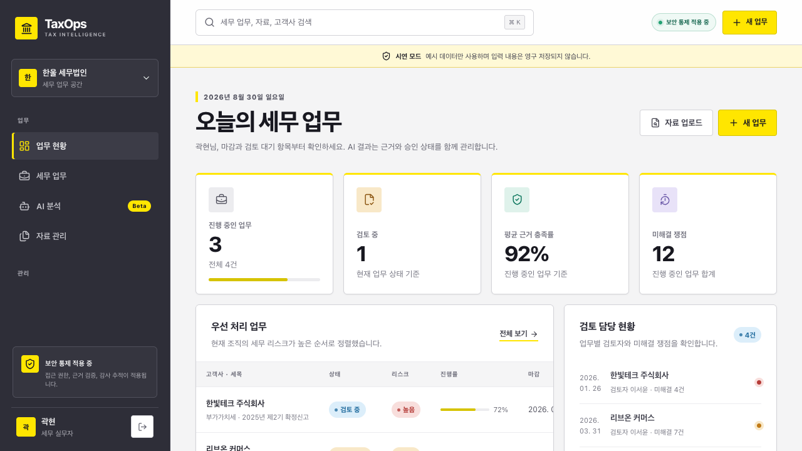
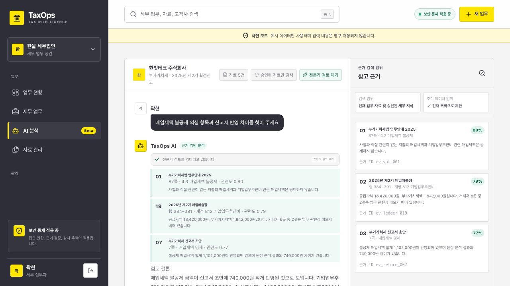
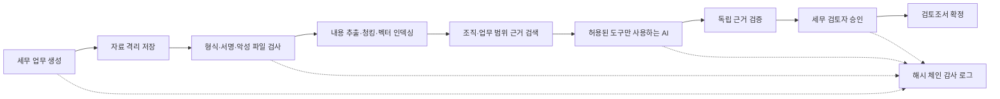

# TaxOps AI

검증된 자료만 AI 검색에 포함하고, 초안의 주장과 근거를 다시 확인한 뒤 세무 검토자의 승인으로 확정하는 세무 업무 플랫폼입니다.

[](https://github.com/kwakhyun/taxops-ai/actions/workflows/ci.yml)

- **프로젝트 성격:** AI 개발 도구를 활용해 만든 개인 채용 포트폴리오
- **구현 범위:** 업무 UX, Next.js 서버, PostgreSQL, 파일 처리, RAG 에이전트, 보안 통제, 관측성과 배포 참조
- **검증 방식:** 타입 검사, 단위·계약·브라우저 테스트, AI 평가, 컨테이너 빌드와 Terraform 검증을 CI에서 반복 실행
- **운영 상태:** [Vercel 공개 데모](https://taxops-ai.vercel.app)와 AWS 운영 환경을 위한 Terraform 참조 구현

공개 데모는 예시 데이터와 결정론적 AI 흐름만 사용하며 입력 내용을 영구 저장하지 않습니다. 실제 고객정보나 개인정보는 입력하지 마세요.



## 5분 검토 방법

1. [라이브 데모](https://taxops-ai.vercel.app)를 열어 마감, 리스크, 근거 충족률을 확인합니다.
2. `⌘K` 또는 `Ctrl+K`를 누르고 `리브온`을 검색해 고객사 세무 업무로 이동합니다.
3. `한빛테크 주식회사` 업무에서 색인 완료 자료의 다운로드와 추가 작업 메뉴를 확인합니다.
4. **AI 분석**에서 `매입세액 불공제 의심 항목과 신고서 반영 차이` 질문을 실행합니다.
5. 답변의 주장별 근거, 원문 위치, 관련도와 전문가 검토 대기 상태를 확인합니다. 근거가 없는 질문에는 답변을 보류합니다.



## 검증 결과

2026년 8월 30일 기준 결과입니다. 최신 상태는 상단 CI 배지에서 확인할 수 있습니다.

| 검증 영역             |          결과 | 확인 범위                                                    |
| --------------------- | ------------: | ------------------------------------------------------------ |
| 단위·코드 계약 테스트 |    84/84 통과 | 보안 통제, 검색, 승인, 비용, 파일 검증과 서버 로직           |
| Chromium 사용자 흐름  |      9/9 통과 | 업무 생성, 검색, 내보내기, 다운로드, 업로드, AI, 승인, MCP   |
| PostgreSQL 운영 계약  |    29/29 통과 | 마이그레이션, 세션 폐기, 임대, RLS, 역할 분리와 트랜잭션     |
| 결정론적 AI 평가      |    45/45 통과 | 검색, 인용 무결성, 답변 보류, 프롬프트 인젝션과 조직 간 누출 |
| 배포 품질 게이트      | 5개 작업 통과 | 전체 검증, 브라우저, DB, 컨테이너 3종과 Terraform            |

코드 커버리지 기준선도 품질 게이트에 포함했습니다. 새 코드로 전체 커버리지가 기준선 아래로 내려가면 CI가 실패합니다.

## 핵심 설계 판단

| 판단                                                   | 구현                                                                                                                    | 자동 검증                                                                    |
| ------------------------------------------------------ | ----------------------------------------------------------------------------------------------------------------------- | ---------------------------------------------------------------------------- |
| 승인되지 않은 자료가 AI 근거로 사용되면 안 됩니다.     | 현재 조직과 업무에 속하고, 보안 검사를 통과한 최신 버전의 승인 자료만 검색합니다.                                       | 미승인 자료, 과거 버전과 다른 조직 자료의 배제 계약 및 AI 평가               |
| AI와 웹 서버가 최종 승인 상태를 직접 바꾸면 안 됩니다. | 웹, 워커, 검토 서비스를 다른 DB 역할로 분리하고 산출물 해시와 행위에 묶인 일회성 승인 토큰을 사용합니다.                | 직접 쓰기 거부, 토큰 재사용 차단과 원자적 상태 전이 계약                     |
| 공개 데모가 운영 구성을 가장하면 안 됩니다.            | 데모 저장소와 PostgreSQL 저장소를 같은 인터페이스 뒤에 두고, 운영 모드에서는 OIDC와 필수 외부 서비스 구성을 강제합니다. | 공개 준비 상태 API의 정보 노출 방지, 운영 설정 검사와 컨테이너 스모크 테스트 |

## 업무 흐름과 구현 범위



- **제품과 서버:** React 19와 Next.js 16 기반 반응형 업무 화면, 권한별 탐색, 통합 검색, Zod 요청 검증, 표준 오류 응답과 요청 ID
- **데이터와 파일:** PostgreSQL 16, Drizzle 스키마와 SQL 마이그레이션, pgvector, RLS, 복합 외래 키, 비공개 격리 저장소, 파일 서명과 OOXML 구조 검사, ClamAV, S3 객체 버전·체크섬 결합
- **AI:** 혼합 검색, 과세기간 기준일, 코드에 등록된 프롬프트 버전 선택과 롤백, 제한된 도구 호출, 별도 검증 에이전트, 답변 보류와 실행별·월간 비용 예산
- **보안과 운영:** OIDC Authorization Code + PKCE, RBAC, 분리된 검토 서비스, 비동기 작업 큐, 재시도·DLQ·서명된 알림, 구조화 로그, Docker, GitHub Actions와 AWS Terraform 참조
- **상호운용:** 현재 조직 범위에서 세무 업무와 근거를 읽는 MCP 서버

세부 구현 근거와 아직 실환경 검증이 필요한 항목은 [요구사항 추적표](docs/requirements-traceability.md)에서 구분했습니다.

## AI 개발 도구 사용과 산출물 검증

개발 과정에서 AI 개발 도구를 요구사항 분해, 코드 작성, 문서화와 검토에 활용했습니다. 생성 결과는 완성품으로 간주하지 않고 다음 절차로 검증했습니다.

1. 모호한 요구사항을 아키텍처, 위협 모델, API 계약, 평가 기준과 운영 런북으로 나눕니다.
2. 변경마다 포맷, ESLint, 웹·워커·검토 서비스 타입 검사를 실행합니다.
3. 단위 테스트에 그치지 않고 실제 PostgreSQL 역할과 트랜잭션, Chromium 사용자 흐름, 공식 MCP 클라이언트로 경계를 확인합니다.
4. 프롬프트, 도구 스키마와 검색 버전을 코드에 두고 평가 보고서에 버전과 결과를 남깁니다.
5. `main` 브랜치의 모든 변경은 GitHub Actions 품질 게이트와 Vercel 자동 배포 결과로 다시 확인합니다.

## 빠른 실행

Node.js 22 이상이 필요합니다.

```bash
npm ci
cp .env.example .env.local
npm run dev
```

브라우저에서 `http://localhost:3000`을 엽니다. 기본 설정은 외부 서비스 없이 재현 가능한 데모 모드입니다. 이 모드는 질문과 검색 근거를 확인해 인용 또는 답변 보류 흐름을 결정하며, 저장된 답변 문장을 그대로 출력하지 않습니다.

실제 AI Gateway를 사용하려면 `.env.local`에 `AI_GATEWAY_API_KEY`를 설정합니다. `AI_PROMPT_VERSION`은 코드에 등록된 프롬프트만 선택하며 기본값은 `tax-memo.v1.3.1`입니다. 운영 모드에 필요한 OIDC, 객체 저장소, 개인정보 비식별화, 문서 처리와 의미 분류기 설정은 [.env.example](.env.example)과 [운영 런북](docs/operations-runbook.md)에 정리했습니다. 준비 상태 API의 의존 서비스별 상세 진단은 운영 전용 `HEALTH_DETAIL_TOKEN`으로만 조회할 수 있습니다.

## 검증 명령

```bash
npm run verify       # 포맷, 린트, 타입, 커버리지 하한, AI 평가, 프로덕션 빌드
npm run test:e2e     # Chromium 사용자 흐름과 공식 MCP 클라이언트
npm run eval         # 45개 결정론적 입력과 5개 모의 에이전트 실행
npm run audit:prod   # 운영 의존성의 심각도 high 이상 취약점 차단
docker compose config -q
docker compose up --build --abort-on-container-exit --exit-code-from contract-test contract-test
docker compose run --rm contract-test npm run test:reviewer-service
docker compose run --rm contract-test node --import tsx scripts/run-worker-smoke.ts
```

AI 품질 게이트는 Recall@5 90% 이상, 인용 원문 무결성 100%, 적대적 주장 무결성 사례 100%, 답변 보류 정확도 90% 이상, 프롬프트 인젝션 차단 100%, 조직 간 정보 누출 0건을 요구합니다.

[평가 보고서](artifacts/evaluation-report.json)는 고정 평가 데이터 검색, 모의 모델 실행 흐름과 코드 수준 무결성 회귀를 검증합니다. 실제 모델의 의미 정확도나 세무 정확도를 보증하는 결과는 아닙니다.

## 운영 환경 참조

`compose.yaml`은 PostgreSQL/pgvector, MinIO, ClamAV, 마이그레이션, 웹, 워커와 독립 검토 서비스를 연결합니다. 세 런타임은 서로 다른 DB 역할을 사용합니다. 웹 역할은 검토조서 버전과 승인 테이블을 직접 변경할 수 없으며, 검토 결정은 승인 기록과 AI 실행 상태를 한 트랜잭션에서 함께 전이합니다.

`infra/terraform`은 기존 VPC와 ALB 위에 다음 리소스를 구성하는 참조 모듈입니다.

- KMS로 암호화된 비공개·버전 관리 S3 버킷
- Multi-AZ RDS PostgreSQL
- 프라이빗 서브넷의 ECS Fargate 웹, 워커와 검토 서비스
- 최소 권한 IAM, 암호화된 CloudWatch 로그, 경보·대시보드와 웹 자동 확장

## 핵심 설계 문서

- [아키텍처와 데이터 흐름](docs/architecture.md)
- [보안 위협 모델](docs/security-threat-model.md)
- [AI 품질, 지연 시간과 비용 관리](docs/ai-quality.md)
- [API와 MCP 계약](docs/api.md)
- [운영 런북](docs/operations-runbook.md)
- [요구사항 추적표](docs/requirements-traceability.md)

## 사실 범위와 남은 검증

- Vercel 배포는 포트폴리오용 데모입니다. 예시 데이터와 결정론적 AI 흐름만 사용하고 입력을 영구 저장하지 않습니다.
- AWS Terraform은 형식과 구성 검증을 통과한 참조 구현이며 실제 계정에 적용하지 않았습니다. 실제 IdP, 세무 원천 시스템, 개인정보 비식별화·의미 분류·문서 처리 서비스와도 연결하지 않았습니다.
- 운영 전에는 세무 전문가의 평가 데이터와 결론 검수, 실제 모델 평가가 필요합니다. 부하 테스트와 복구 테스트, 침투 테스트도 수행해야 하며 개인정보 영향평가와 법무 및 보존 정책 승인도 별도로 받아야 합니다.
- 공식 세무 원천의 서명 또는 신뢰 가능한 해시값 검증이 필요합니다. 감사 체인도 조직 환경의 외부 WORM 저장소와 서명 기준점에 연결해야 합니다.
- 이 프로젝트는 EY의 공식 제품이나 보증물이 아닙니다.
