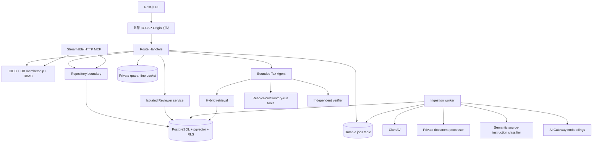

# 아키텍처와 데이터 흐름

## 설계 목표

TaxOps AI는 세무 전문가의 판단을 대체하지 않습니다. 검역된 고객 자료에서 근거를 찾고, 계산 가능한 부분은 결정론적 도구로 처리하며, 결론과 근거의 연결을 별도 검증한 뒤 Reviewer에게 승인 가능한 초안을 제공하는 것이 목표입니다.

## 런타임 경계

웹 런타임, 워커, Reviewer는 별도 컨테이너와 DB 역할을 사용합니다. 웹은 workpaper lineage 테이블을 직접 변경할 수 없고, Reviewer 서비스는 별도 OIDC audience와 scope, 최근 MFA 인증을 검증한 뒤 제한된 DB 함수만 호출합니다. API는 `src/lib/repository` 경계를 통해 데모 저장소와 PostgreSQL 저장소를 교체합니다. `DATABASE_URL`이 없으면 로컬 데모가 동작합니다. 프로덕션 웹 readiness는 DB와 Reviewer 연결을 호출하고 나머지 필수 서비스의 보안 설정을 검증합니다. Worker는 시작 시 DB, 객체 저장소, ClamAV 연결을 호출하고 인증된 DLP, 문서 처리기, 의미 분류기 설정을 강제합니다.

## 주요 흐름

### 문서 수집

1. API가 사용자 권한과 케이스 소속을 확인합니다.
2. 확장자, MIME, 파일 서명, 크기와 경로 안전성을 검증하고 SHA-256을 계산합니다.
3. 파일을 케이스별 quarantine key에 저장한 뒤 문서 레코드와 작업을 한 트랜잭션에서 만듭니다.
4. 워커가 `FOR UPDATE SKIP LOCKED` 기반 보안 함수로 작업을 임대합니다.
5. 업로드 시 받은 S3 version ID, ETag와 SHA-256을 다시 확인하고 ClamAV를 통과한 정확한 객체만 clean key로 승격합니다. PDF, DOCX, XLSX는 비공개 처리 서비스를 사용합니다.
6. 파일명, 발행기관, URI, 본문과 section을 DLP 처리 후 인증된 의미 분류기로 검사하고 결과의 modelVersion, threshold, score를 문서에 기록합니다.
7. 청크와 임베딩, 근거 manifest를 새 버전으로 기록한 뒤에만 `SAFE` 문서를 `INDEXED`로 전환합니다.
8. Reviewer가 정확한 checksum, version, manifest에 묶어 승인한 뒤에만 RAG 검색에 포함합니다.
9. 실패는 제한된 재시도와 jitter를 거쳐 DLQ 상태로 이동합니다.

검역 이전 자료, 승인되지 않은 문서, 과거 버전 청크는 검색 쿼리에서 제외됩니다.

### AI 분석

1. 요청 길이, prompt injection 패턴, rate limit, 사용자 권한과 케이스 소속을 확인합니다.
2. 질문을 임베딩하고 벡터 유사도 65%, PostgreSQL full-text 35%의 hybrid score로 검색합니다.
3. 검색은 `tenant_id`, `matter_id`, `is_current`, `document.status = INDEXED`, `evidence_status = APPROVED`, 해당 과세기간의 효력 기간을 모두 강제합니다.
4. 주 에이전트는 최대 8단계와 실행 예산 안에서 검색, 계산, 근거 확인, 워크페이퍼 제안 도구를 사용합니다.
5. 쓰기 성격의 도구는 실제 변경 대신 승인 대상 초안을 만듭니다.
6. 별도 검증 에이전트가 주장별 근거와 계산을 확인합니다. 근거가 부족하면 답변을 기권합니다.
7. Reviewer 승인 전 결과는 외부 게시 가능한 상태가 아닙니다.

## 데이터 모델

핵심 테이블은 tenant, user, membership, client, matter, document, document_chunk, job, outbox, rate_limit_bucket, prompt_version, agent_run, retrieval_event, tool_call, workpaper, workpaper_version, approval, audit_event입니다.

- 모든 고객 데이터는 `tenant_id`를 포함합니다.
- 중요한 관계는 테넌트 ID를 포함한 복합 외래 키로 연결합니다.
- RLS는 요청별 `app.tenant_id` 설정을 기준으로 읽기와 쓰기를 제한합니다.
- 감사 이벤트는 이전 해시를 포함하고 애플리케이션에서 수정·삭제할 수 없습니다. DB verifier가 조회 제한과 무관하게 해당 테넌트의 전체 체인을 재계산합니다.
- 업로드 작업은 테넌트 범위 idempotency key로 중복 생성을 막습니다.

## 고장 처리

- AI Gateway 오류: 재시도 제한 후 사용자에게 추적 가능한 오류를 반환하며, 근거 없는 fallback 결론을 만들지 않습니다.
- 검색 결과 없음: 명시적으로 기권하고 필요한 자료를 안내합니다.
- 파일 처리 실패: 문서를 `FAILED`로 표시하고 검색에서 제외합니다.
- 워커 중단: lease 만료 후 다른 워커가 작업을 재임대합니다.
- 승인 토큰 재사용: 행위와 artifact hash에 결합된 서명을 검증하고, 조건부 DB update로 `PENDING`을 정확히 한 번만 전이합니다. 최종 함수가 최소 1건의 근거 ID, 원문, 위치, 출처 유형과 provenance, hash를 현재 DB 필드와 전체 대조하고 approval과 agent run을 한 트랜잭션에서 전이합니다.
- DB 또는 필수 production 설정 누락: readiness가 503을 반환합니다.
