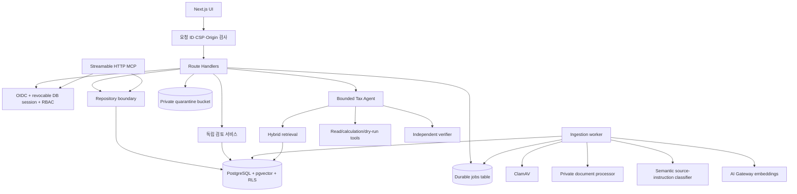

# 아키텍처와 데이터 흐름

## 설계 목표

TaxOps AI는 세무 전문가의 판단을 대체하지 않습니다. 검역된 고객 자료에서 근거를 찾고, 계산 가능한 부분은 결정론적 도구로 처리하며, 결론과 근거의 연결을 별도로 검증한 뒤 세무 검토자에게 승인 가능한 초안을 제공하는 것이 목표입니다.

## 문서 용어 기준

화면과 문서에서는 조직, 세무 업무, 자료, 검토조서, 세무 검토자를 기본 용어로 사용합니다. 코드나 데이터베이스 식별자를 설명할 때만 `tenant`, `matter`, `document`, `workpaper`, `reviewer`를 그대로 표시합니다. 사람인 세무 검토자와 독립 실행 환경인 검토 서비스를 구분합니다.

## 런타임 경계

웹 런타임, 워커와 검토 서비스는 별도 컨테이너와 DB 역할을 사용합니다. 웹은 검토조서 이력 테이블을 직접 변경할 수 없습니다. 검토 서비스는 별도 OIDC 대상값과 권한 범위, 최근 MFA 인증을 검증한 뒤 제한된 DB 함수만 호출합니다.

API는 `src/lib/repository` 경계를 통해 데모 저장소와 PostgreSQL 저장소를 교체합니다. `DATABASE_URL`이 없으면 로컬 데모가 동작합니다.

운영 환경의 웹 준비 상태 검사는 DB와 검토 서비스 연결을 확인하고 나머지 필수 서비스의 보안 설정을 검증합니다. 워커는 시작할 때 DB, 객체 저장소와 ClamAV 연결을 확인합니다. 인증된 개인정보 비식별화 서비스, 문서 처리기와 의미 분류기 설정도 강제합니다.

## 주요 흐름

### 문서 수집

1. API가 사용자 권한과 세무 업무 소속을 확인합니다.
2. 확장자, MIME, 파일 서명, 크기와 경로 안전성을 검증하고 SHA-256을 계산합니다.
3. 파일을 세무 업무별 격리 키에 저장한 뒤 자료 레코드와 작업을 한 트랜잭션에서 만듭니다.
4. 워커가 `FOR UPDATE SKIP LOCKED` 기반 보안 함수로 작업을 임대합니다.
5. 업로드 시 받은 S3 버전 ID, ETag와 SHA-256을 다시 확인하고 ClamAV를 통과한 정확한 객체만 정제 영역으로 옮깁니다. PDF, DOCX와 XLSX는 비공개 처리 서비스를 사용합니다.
6. 파일명, 발행기관, URI, 본문과 구역명을 개인정보 비식별화 처리한 후 인증된 의미 분류기로 검사합니다. 결과의 모델 버전, 임계값과 점수를 자료에 기록합니다.
7. 청크, 임베딩과 근거 명세를 새 버전으로 기록한 뒤에만 `SAFE` 자료를 `INDEXED`로 전환합니다.
8. 세무 검토자가 정확한 체크섬, 버전과 근거 명세에 묶어 승인한 뒤에만 RAG 검색에 포함합니다.
9. 실패는 제한된 재시도와 무작위 지연을 거쳐 DLQ 상태로 이동합니다.

검역 이전 자료, 승인되지 않은 문서, 과거 버전 청크는 검색 쿼리에서 제외됩니다.

### AI 분석

1. 요청 길이, 프롬프트 인젝션 패턴, 요청 제한, 사용자 권한과 세무 업무 소속을 확인합니다.
2. 질문을 임베딩하고 벡터 유사도 65%, PostgreSQL 전문 검색 35%의 혼합 점수로 검색합니다.
3. 검색은 `tenant_id`, `matter_id`, `is_current`, `document.status = INDEXED`, `evidence_status = APPROVED`, 해당 과세기간의 효력 기간을 모두 강제합니다.
4. 주 에이전트는 최대 8단계와 실행 예산 안에서 검색, 계산, 근거 확인, 검토조서 제안 도구를 사용합니다.
5. 쓰기 성격의 도구는 실제 변경 대신 승인 대상 초안을 만듭니다.
6. 별도 검증 에이전트가 주장별 근거와 계산을 확인합니다. 근거가 부족하면 답변을 보류합니다.
7. 세무 검토자 승인 전 결과는 외부 게시 가능한 상태가 아닙니다.

## 데이터 모델

핵심 데이터 모델은 19개 테이블과 8개 enum으로 구성됩니다. 테이블은 `tenants`, `users`, `memberships`, `web_sessions`, `clients`, `matters`, `documents`, `document_chunks`, `jobs`, `outbox_events`, `rate_limit_buckets`, `prompt_versions`, `agent_runs`, `retrieval_events`, `tool_calls`, `workpapers`, `workpaper_versions`, `approvals`, `audit_events`입니다. enum은 `membership_role`, `matter_status`, `risk_level`, `document_status`, `job_status`, `workflow_status`, `approval_status`, `audit_outcome`입니다.

- 모든 고객 데이터는 조직을 식별하는 `tenant_id`를 포함합니다.
- 브라우저 세션의 `jti`는 `web_sessions`에 기록하며 로그아웃 시 즉시 폐기합니다.
- 중요한 관계는 조직 ID를 포함한 복합 외래 키로 연결합니다.
- RLS는 요청별 `app.tenant_id` 설정을 기준으로 읽기와 쓰기를 제한합니다.
- 감사 이벤트는 이전 해시를 포함하고 애플리케이션에서 수정·삭제할 수 없습니다. DB 검증기가 조회 제한과 무관하게 해당 조직의 전체 체인을 재계산합니다.
- 업로드 작업은 조직 범위 멱등성 키로 중복 생성을 막습니다.

## 고장 처리

- AI Gateway 오류: 재시도 제한 후 사용자에게 추적 가능한 오류를 반환하며, 근거 없는 대체 결론을 만들지 않습니다.
- 검색 결과 없음: 답변을 보류하고 필요한 자료를 안내합니다.
- 파일 처리 실패: 문서를 `FAILED`로 표시하고 검색에서 제외합니다.
- 워커 중단: 임대 시간이 끝나면 다른 워커가 작업을 다시 임대합니다.
- 알림 전송 중단: Outbox 임대가 만료된 뒤 다른 워커가 같은 멱등성 키로 다시 전송합니다.
- 승인 토큰 재사용: 행위와 산출물 해시에 결합된 서명을 검증하고, 조건부 DB 갱신으로 `PENDING`을 정확히 한 번만 전이합니다. 최종 함수는 최소 1건의 근거 ID, 원문, 위치, 출처 유형, 출처 이력과 해시를 현재 DB 필드와 대조하고 승인 기록과 AI 실행 상태를 한 트랜잭션에서 전이합니다.
- DB 또는 필수 운영 설정 누락: 준비 상태 API가 503을 반환합니다.
